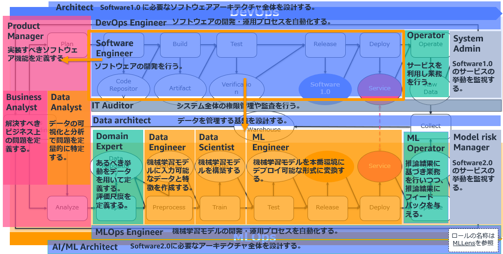
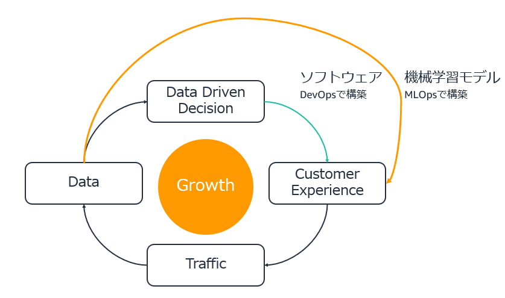

# はじめに

## ハンズオンの概要

本ハンズオンを通じ、機械学習モデルがビジネス価値に貢献するよう開発する方法を学ぶことができます。機械学習モデルの要件確認から運用監視までを10のプロセスで定義し、そのうち「開発」にあたる6つのプロセスを本教材の対象としています。次の図では、既存のソフトウェア開発プロセスをDevOpsとし、機械学習モデルの開発プロセスをMLOpsとし上下に分けて示しています。本教材の対象は、図のオレンジの枠で囲った箇所です。

| 英語名                 | 日本語名     | なにをするのか                             |
|------------------------|--------------|---------------------------------------|
| Business Understanding | ビジネス理解 | ビジネス上発生している問題を機械学習モデルの予測がどのように解決するのか、関係者へのヒアリングを通じ理解しBusiness goalを設定する。                               |
| Analyze                | データ分析   | Business goalを達成するために現状手に入るデータが必要十分であるか、データ分析を行いAnalysis Reportを作成する。                                              |
| Prepare                | データ準備   | Analysis Reportをステークホルダーに共有し、必要なデータや不足しているデータの収集や作成を行いDatasetを作成する。                                          |
| Preprocess             | 前処理       | Datasetを機械学習モデルが認識しやすい形に変換し、Preprocessed   Datasetを作成する。必要に応じデータ同士を組み合わせて新しいデータを作るFeature Engineeringを行う。|
| Train                  | 学習         | Preprocessed Datasetを用い、Modelを学習する。                                                                                                    |
| Test                   | テスト       | Modelが意図した通りに構築されているか、インプット、プロセス、アウトプットの観点から評価しTest Reportを作成する。Test   Reportには、Business goalを達成できているかの評価を含める。 |

各プロセスの解説は、**なにをするのか**、**なぜやるのか**、**どうやるのか**の3つから構成されます。どうやるのかは、**プログラミング演習**と**コミュニケーション演習**の2つから構成されます。機械学習モデルの開発を進めるためのPythonによるプログラミングをプログラミング演習で、開発プロセスの手順や内容を他のロールの人に確認するための質問作成をコミュニケーション演習で行います。

1. なにをするのか
2. なぜやるのか
3. どうやるのか
   * プログラミング演習
   * コミュニケーション演習

各プロセスの学習時間は10~20分程度です。`README.md`の目次に沿い、自習形式で進めることが可能です。ただ、他のチームメンバーを巻き込んでコミュニケーション演習を行うことでより実際の機械学習モデルの開発に近い演習ができます。

## ハンズオンのゴール

学習のゴールは3つです。機械学習モデルの開発を担当するデータサイエンティスト以外の方は、3のアクションが取れるようになって頂きたいと思います。

1. データサイエンティストとして、機械学習モデルの各開発プロセスでどのような実装が必要かPythonを用いたデモを示せるようになる。
2. データサイエンティストとして、機械学習モデルの各開発プロセスで他のステークホルダーにJupyter Notebookを提示しながら必要な確認をとれるようになる。
3. 機械学習モデル開発に関わるステークホルダーとして、機械学習モデルの各開発プロセスでデータサイエンティストに対し適切な声掛け、アドバイスができるようになる。

研究者の方など、機械学習モデルをビジネスに活かすための開発プロセスが関心の中心ではない方もいるかもしれません。企業と共同研究をするときなどに、本プロセスに沿った開発プロセスが敷かれているかを聞くことは共同研究成果が実際に活かされるかに繋がりますので、頭の片隅に本ハンズオンの内容を置いていただければ幸いです。

本ハンズオンでは、TensorFlow/PyTorchでDeep Learningのモデルを構築する方法は扱っていません。ただ、Deep Learningでも機械学習モデルの開発プロセスは変わらないためプロジェクトの進め方として参考になると思います。また、機械学習の理論的な内容は解説していません。実務上より深い知識が求められるようになった場合に備え、各プロセスで参考書籍を記載しているためそちらを参照いただければと思います。

学習環境として、ブラウザベースでJupyter Notebookを作成でき、Gitと統合されているAmazon SageMaker Studio Labを使用しています。

## ハンズオンが生まれた理由

AWSはより多くのお客様に機械学習を活用してビジネス価値を創出していただきたいと考えています。DevOpsとMLOpsの2輪が揃うことで、高速に競争優位を確立することができます。DevOpsとMLOpsを両立させているプロダクトの例を示しますが、名前を見ただけでどれだけ他の企業の参入が困難であると感じていただけると思います。

MLOpsにより蓄積されたデータがユーザー体験の向上につながり、ユーザー体験の向上がさらなるデータの蓄積につながる循環が生まれ、競争優位に繋がります。

データサイエンティストだけではMLOpsを構築することはできません。次の図から、多くのロールが実現に関わっていることがわかると思います。本ハンズオンが、プログラミング演習だけでなく、コミュニケーションの演習を含んでいるのはこのためです。

ロールの説明

| 英語名             | 日本語名                   | 役割                                                                 |
|--------------------|----------------------------|----------------------------------------------------------------------|
| Product Manager    | プロダクトマネージャー     | ユーザー体験を向上させるために実装すべきソフトウェア機能を定義する。 |
| Business Analyst   | ビジネスアナリスト         | 解決すべきビジネス上の問題を定義する                                 |
| Data Analyst       | データアナリスト           | データの可視化と分析で問題を定量的に特定する。                       |
| Architect          | アーキテクト               | ソフトウェアアーキテクチャ全体を設計する。                           |
| DevOps Engineer    | DevOpsエンジニア           | ソフトウェアの開発・運用プロセスを自動化する。                       |
| Software Engineer  | ソフトウェアエンジニア     | ソフトウェアの開発を行う。                                           |
| Operator           | 業務担当者                 | ソフトウェアを利用し業務を行う。                                     |
| System Admin       | システム管理者             | サービスの挙動を監視する。                                           |
| IT Auditor         | IT監督者                   | システムや会社全体の権限管理や監査を行う。                           |
| Data architect     | データアーキテクト         | データを管理する基盤を設計、運用する。                               |
| Domain Expert      | 業務有識者                 | 深い業務知識を持ちデータの意味やあるべき状態について定義する。       |
| Data Engineer      | データエンジニア           | 機械学習モデルに入力可能なデータと特徴を作成する。                   |
| Data Scientist     | データサイエンティスト     | 機械学習モデルを開発する。                                           |
| ML Engineer        | 機械学習エンジニア         | 機械学習モデルを本番環境にデプロイ可能な形式に変換する。             |
| ML Operator        | 業務担当者(機械学習側)     | 推論結果に基づき業務を行いつつ、フィードバックを与える。             |
| Model risk Manager | 機械学習モデルリスク管理者 | 機械学習モデルの推論の挙動を監視する。                               |
| MLOps Engineer     | MLOpsエンジニア            | 機械学習モデルの開発・運用プロセスを自動化する。                     |
| AI/ML Architect    | AI/MLアーキテクト          | 機械学習モデル開発に必要なアーキテクチャ全体を設計する。             |

## Next Step

機械学習モデルの開発を始める前の、環境構築からハンズオンを開始します。

[Environmental Setup](../notebooks/00_environment_setup.ipynb)

## Future of Hands-on

本ハンズオンはGitHubで公開しています。本教材を社内での研修やチームの立ち上げにぜひ役立てていただければと思います。改善点などあれば、GitHubのIssueでお知らせいただければと思います。本ハンズオンのコンテンツを皆様の協力を得ながらよりよいものにしたいと考えています。

## References

1. Takahiro Kubo. [MLOpsのこれまでとこれから](https://speakerdeck.com/icoxfog417/mlopsfalsekoremadetokorekara). 2022.
